# **InvoiceManagementSystem** #
InvoiceManagementSystem is a mini ASP.NET MVC application designed to help practice and apply essential software development concepts.
The system focuses on real-world challenges such as optimizing performance with dynamic partial page loading using JavaScript, and providing full invoice operations including exporting, printing, caching, and pagination.
This project demonstrates clean architecture principles and practical solutions commonly used in production systems.

## **⭐ Key Features**

* Dynamic **partial page loading** using JavaScript to improve performance.
* Export invoices to **PDF** and **Excel** based on a selected date range.
* **Rate limiting** implementation (maximum 5 requests per minute).
* Invoice printing in both **A4** and **small POS receipt** sizes.
* Interactive **popup modal interface** for improved user experience.
* **Caching** integrated to speed up data retrieval and reduce load.
* Full **pagination** support for navigating large data lists.

## **🔗 Live Demo**

[https://simpleinvoice.runasp.net/Identity/Account/Login](https://simpleinvoice.runasp.net/Identity/Account/Login)

## 📌 Technologies Used

### Core Technologies
- ASP.NET MVC  
- Entity Framework Core  
- JavaScript  
- HTML / CSS / Bootstrap  
- SQL Server 
- ASP.NET Identity  
- .NET 8  

### NuGet Packages & Libraries
- AspNetCoreRateLimit – for rate limiting  
- ClosedXML – for Excel export  
- iTextSharp – for PDF generation  
- Microsoft.EntityFrameworkCore.SqlServer 
- Microsoft.EntityFrameworkCore.Tools  
- Microsoft.AspNetCore.Identity.EntityFrameworkCore  
- Microsoft.AspNetCore.Identity.UI  
- Microsoft.VisualStudio.Web.CodeGeneration.Design  
- QRCoder – for QR code generation  
- toastr – for UI notifications  

## **🖼️ Screenshot**

**InvoiceManagementSystem – Sample Invoice and Dashboard Preview**

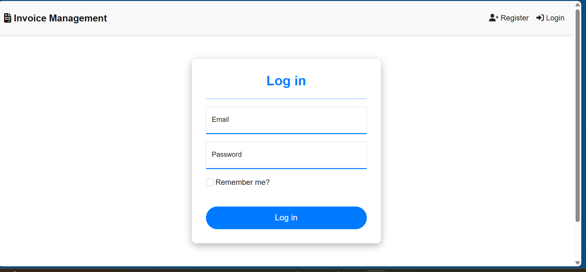

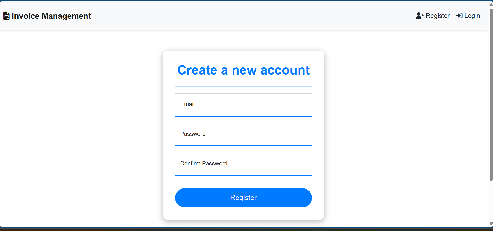

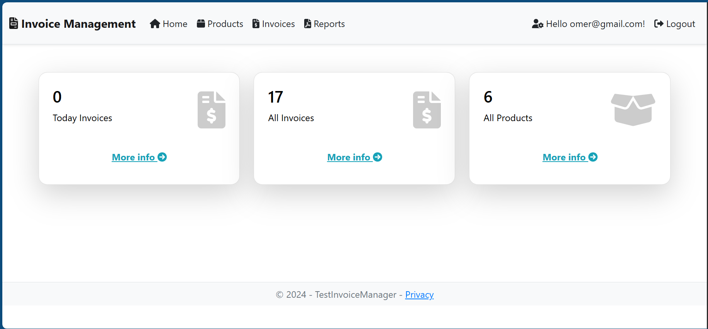

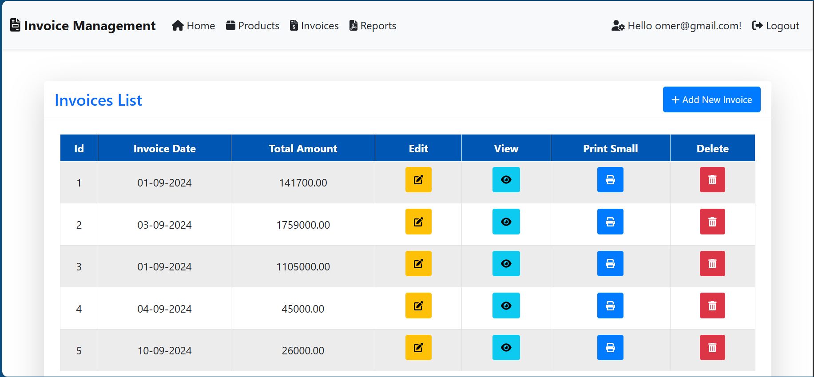

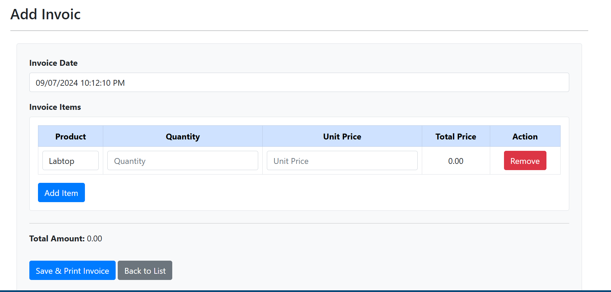

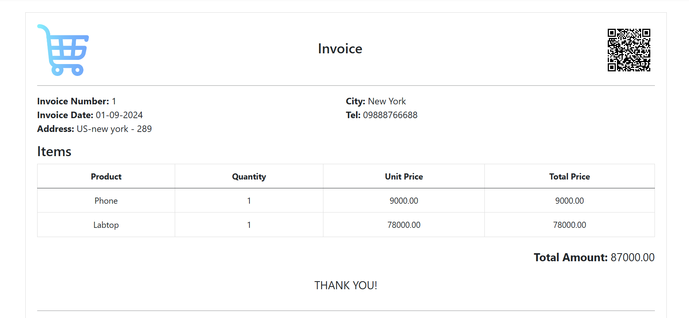

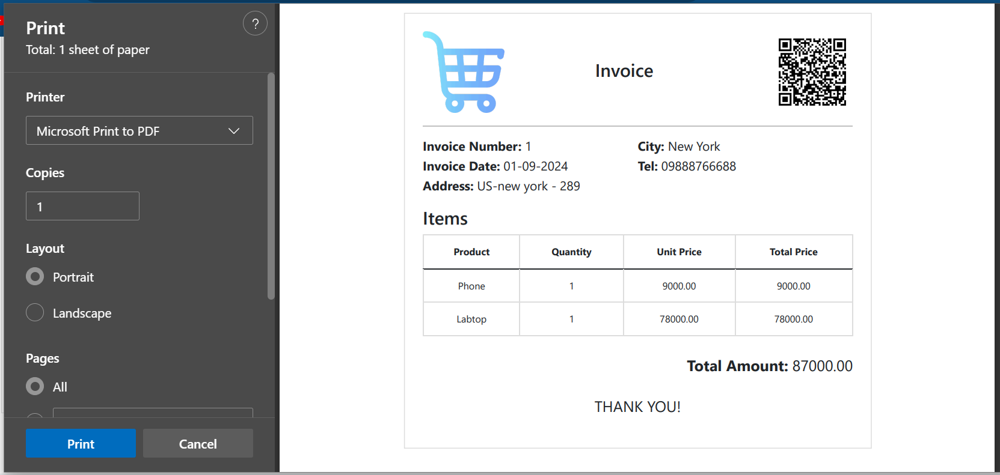

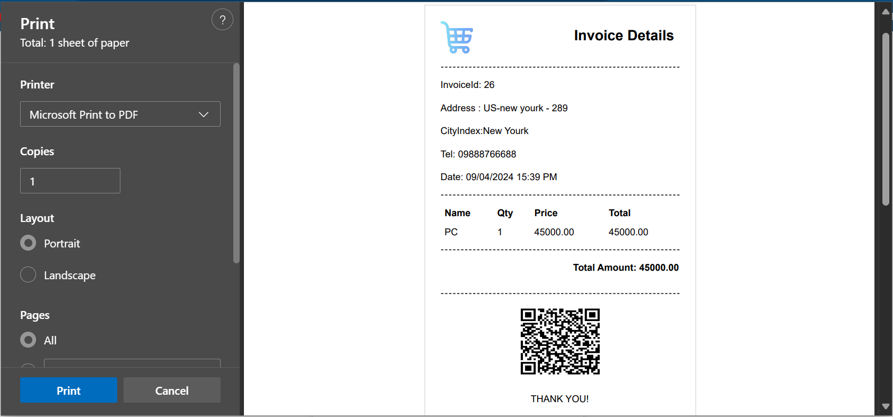

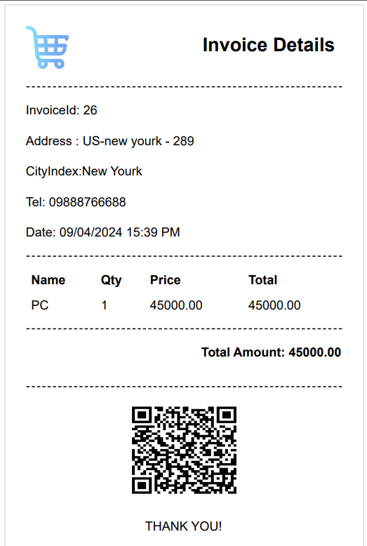

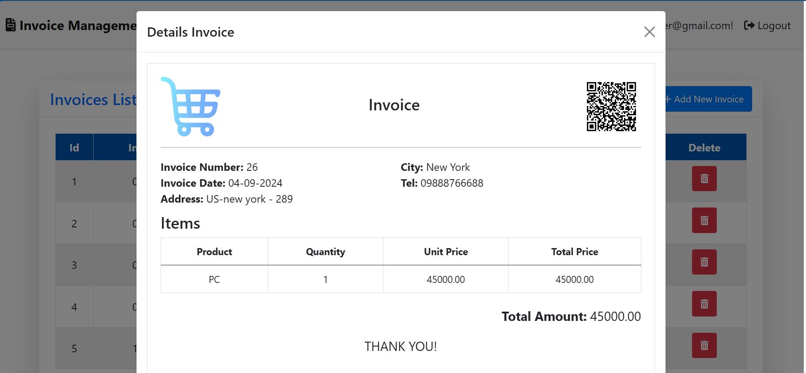

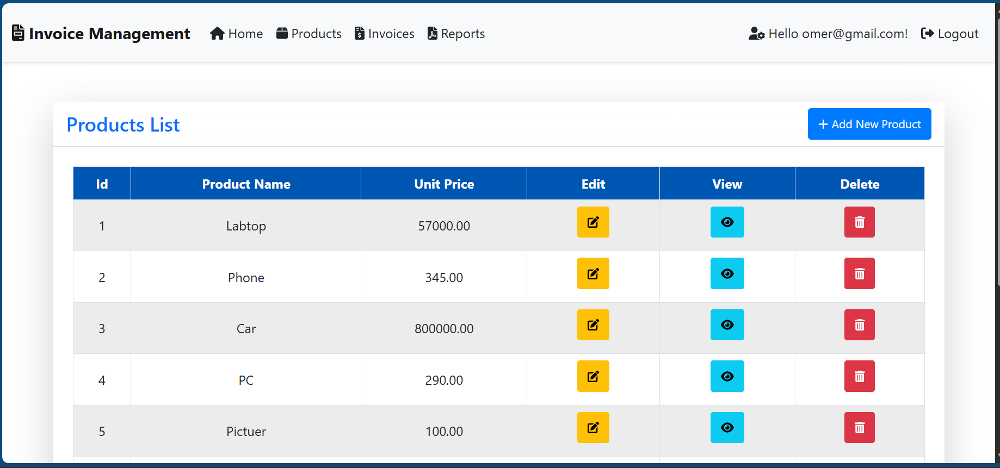

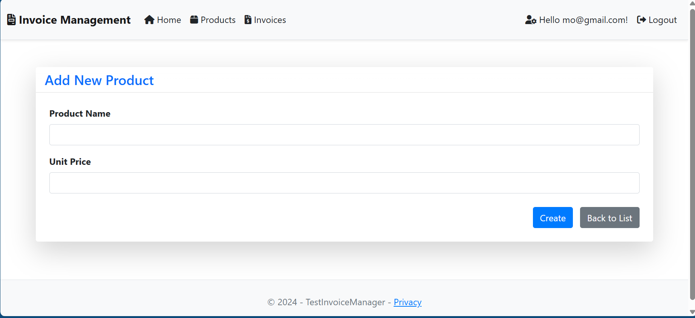

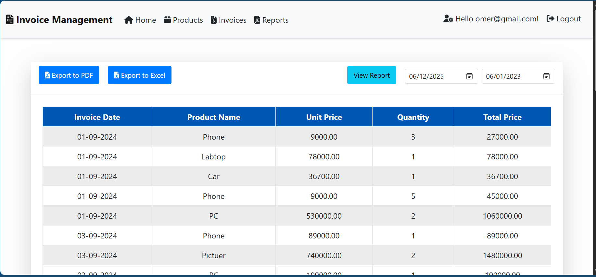

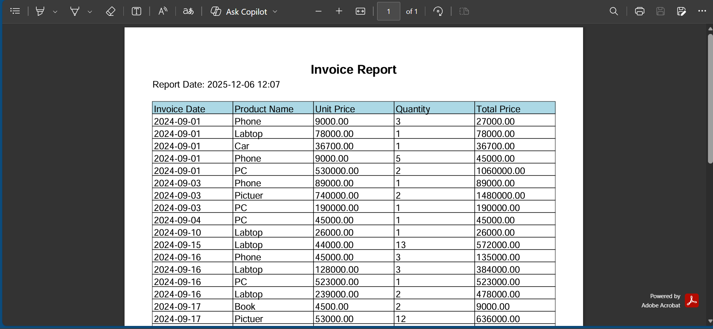

